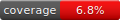

# nuri-cms

**nuricms is a api first content management system written in go.**

---



---

## Installation

To install and use NuriCMS as a dependency in your Go project, follow the steps below.

### 1. Add NuriCMS as a Dependency

You can add NuriCMS to your Go project using `go get`. In your Go project directory, run the following command:

```bash
go get github.com/janmarkuslanger/nuricms
```

This will add NuriCMS as a dependency to your project and fetch the latest version.

### 2. Create Your `main.go` to Start the Server

After adding NuriCMS as a dependency, you need to create a `main.go` file in your project to start the server.

#### Example `main.go`:

```go
package main

import (
	"os"
	"github.com/janmarkuslanger/nuricms"
)

func main() {
	config := &nuricms.ServerConfig{
		Port: os.Getenv("PORT"),
	}

	if config.Port == "" {
		config.Port = "8080"
	}

	nuricms.StartServer(config)
}
```

The JWT_SECRET environment variable should be set:

```bash
# Set a basic JWT secret (for development purposes)
export JWT_SECRET=anything

# Generate a secure JWT secret (recommended for production)
export JWT_SECRET=$(openssl rand -base64 32)
```

Then run the following command to start the server:

```bash
go run main.go
```

If the server gets started and there is no user in the system there will be an admin account added:

- E-Mail: admin@admin.com 
- Password: mysecret

The server will now run at `http://localhost:8080`. You can change the port by modifying the configuration.