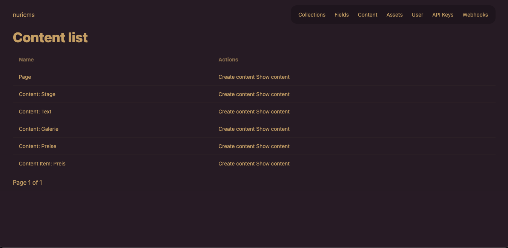

# nuri-cms

**nuricms is a api first content management system written in go.**

---



---


---

## Installation

To install and use NuriCMS as a dependency in your Go project, follow the steps below.

### 1. Add NuriCMS as a Dependency

You can add NuriCMS to your Go project using `go get`. In your Go project directory, run the following command:

```bash
go get github.com/janmarkuslanger/nuricms
```

This will add NuriCMS as a dependency to your project and fetch the latest version.

### 2. Create Your `main.go` to Start the Server

After adding NuriCMS as a dependency, you need to create a `main.go` file in your project to start the server.

#### Example `main.go`:

```go
package main

import (
	"github.com/janmarkuslanger/nuricms"
	"github.com/janmarkuslanger/nuricms/pkg/plugin"
)

func main() {

	config := &nuricms.ServerConfig{
		Port:        "8080",
		HookPlugins: []plugin.HookPlugin{},
	}

	nuricms.StartServer(config)
}
```

The JWT_SECRET environment variable should be set:

```bash
# Set a basic JWT secret (for development purposes)
export JWT_SECRET=anything

# Generate a secure JWT secret (recommended for production)
export JWT_SECRET=$(openssl rand -base64 32)
```

Then run the following command to start the server:

```bash
go run main.go
```

If the server gets started and there is no user in the system there will be an admin account added:

- E-Mail: admin@admin.com 
- Password: mysecret

The server will now run at `http://localhost:8080`. You can change the port by modifying the configuration.

## Plugin System

`nuricms` provides a modular plugin system. Plugins can be passed to the CMS via the `ServerConfig` at startup and allow extending various parts of the system — such as hooks, routes, or UI components.

### Usage

Plugins are passed in during server initialization:

```go
config := &nuricms.ServerConfig{
    Port: "8080",
    HookPlugins: []nuricms.HookPlugin{
        &MyCustomPlugin{},
    },
}

nuricms.StartServer(config)
```

---

### HookPlugin

A `HookPlugin` allows you to register functions for specific system events (hooks), such as `"content:beforeSave"`. A hook plugin implements the following interface:

```go
type HookPlugin interface {
    Name() string
    Register(h *HookRegistry)
}
```

### Example

```go
package plugins

import (
	"strings"

	"github.com/janmarkuslanger/nuricms/internal/model"
	"github.com/janmarkuslanger/nuricms/pkg/plugin"
)

type SlugPlugin struct{}

func (p *SlugPlugin) Name() string {
	return "AutoSlug"
}

func (p *SlugPlugin) Register(h *plugin.HookRegistry) {
	h.Register("contentValue:beforeSave", func(p any) error {
		content := p.(*model.ContentValue)

		if content.Field.Alias == "slug" {
			content.Value = strings.ToLower(content.Value)
		}

		return nil
	})
}

```

Then register your plugin in your `main.go`:

```go
cfg := &nuricms.ServerConfig{
    Port: "8080",
    HookPlugins: []nuricms.HookPlugin{
        &myplugin.SlugPlugin{},
    },
}

nuricms.StartServer(cfg)
```

### Events 

- contentValue:beforeSave 

---
